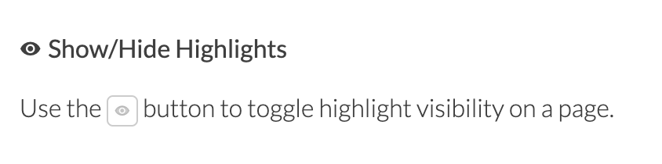
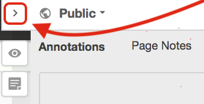

# Cases and Examples of Learning Analytics

This week we will:

1. Develop familiarity with ways computational methods can be used to support research
2. Develop familiarity with real-world learning analytics tools and applications
3. Continue to explore course project ideas

Thanks for the engaged conversations on both Hypothes.is and Slack! Great collaborative work (like [this thread](https://hyp.is/NFor1vhTEeq9wSM8TXN_OQ/www.solaresearch.org/wp-content/uploads/2017/05/chapter4.pdf)) as we make sense of complex ideas in course readings. Please keep it up!

Two Pro Tips about Hypothes.is: 

1. If you prefer to not see existing highlights when reading an article, click on the Hide/Show Highlights button on the sidebar.  

2. You can also resize the sidebar, click and hold on the Arrow button and then drag to resize the sidebar.  

## Learning Analytics Cases and Examples

After reading and discussing several key articles about learning analytics, I hope it is becoming clearer that there are often two types of work involved when people talk about learning analytics:

1. **Applying computational methods** (or data science methods) to learning data to help us understand complex learning phenomena
2. **Designing and deploying tools** that are based on computational analysis of learning data to make an impact in a learning context

Researchers of learning (e.g. learning scientists) may feel more drawn to the first, while folks who engineer tools or work closely with people who make day-to-day decisions in education (e.g. teachers, advisers, students, administrators) could be more attracted to the latter. Of course, these two lines are not clear-cut but deeply intertwined. 

Both lines require us to think carefully about ethics, accountability, and integrity in the work, even though the considerations and coping strategies may differ between these two lines. 

## Week 4 Learning Activities

This week, we will explore and analyze more concrete cases/examples of learning analytics. 

Following the distinction made above, you can purposefully target one type of work in your interest area. 

Use Hypothes.is as a social annotation tool for example. As a researcher, I am curious about what factors are driving our social interaction and would be interested in learning data science methods that would allow me to model social interaction. As a learning technologist, I am also interested in supporting instructors who teach online classes using Hypothes.is. What information might be useful for their decision-making? How to best present such information? And, to tell you the truth, I am actually interested in both directions!

Please take time to think about your interests at this moment so that your exploration can become more targetted. 

### Meet Two Experts

Before we dive into identifying and analyzing cases, I want to share two talks that are related to this week and the projects you are working on. 

The first talk was given by **[Dr. Stephanie Teasley](https://www.si.umich.edu/people/stephanie-teasley)** from the University of Michigan, a powerhouse of learning analytics research & practice. Teasley is a past president of SoLAR and has been leading various learning analytics efforts at UMich, including the __*My Learning Analytics (MyLA)*__ project that is piloted at UMN. She gave a talk, titled "**Learning Analytics: Data Science for Education**", which covers many grounds including analytics tool design and evaluation. 

<iframe width="560" height="315" src="https://www.youtube.com/embed/w3u_Cv7bUHU" frameborder="0" allow="accelerometer; autoplay; encrypted-media; gyroscope; picture-in-picture" allowfullscreen></iframe>

<!-- The second talk was an *ACM TechTalk* delivered by **Prof. [Joseph Konstan](http://konstan.umn.edu/)** from our own University of Minnesota. This talk, titled "**Recommender Systems: Beyond Machine Learning**", is more technical and of special interest to those of you interested in adaptive learning and educational recommender systems. Below are the slides [in PDF]. To watch the talk, you will need to fill out the registration form near the bottom of [this ACM page](https://event.on24.com/eventRegistration/EventLobbyServlet?target=reg20.jsp&referrer=&eventid=2087659&sessionid=1&key=0321266D048A6229BB85D34C4BB1FC66&regTag=&sourcepage=register), which will direct you to a recorded webinar.  

<iframe width="560" height="315" src="https://www.youtube-nocookie.com/embed/uupJmZG5xxA" frameborder="0" allow="accelerometer; autoplay; clipboard-write; encrypted-media; gyroscope; picture-in-picture" allowfullscreen></iframe>

-->

The second talk was given by **[Dr. Roberto Martinez-Maldonado](http://roberto.martinezmaldonado.net/)** from Monash University, who previously worked at the Connected Intelligence Centre (CIC) of the University of Technology Sydney. This talk is about a a *Multimodal Learning Analytics* project in a medical education setting. You can find more details in [their paper here](https://dl.acm.org/doi/abs/10.1145/3313831.3376148) published in the hyper-competitive CHI conference. 

<iframe width="560" height="315" src="https://www.youtube-nocookie.com/embed/xGsyOla3cy0" frameborder="0" allow="accelerometer; autoplay; clipboard-write; encrypted-media; gyroscope; picture-in-picture" allowfullscreen></iframe>

### Case analysis

After watching these videos, please conduct a learning analytics *case analysis* following these two main steps. 

#### (a) Identify {-}

Ideally, you will **identify minimally one case/example** potentially relevant to your project idea. 

I am providing only a few examples below but you should absolutely go beyond this list. 

- Course Signals: [EDUCAUSE article](https://er.educause.edu/articles/2010/3/signals-applying-academic-analytics), [LAK12 video](https://www.youtube.com/watch?v=kURsmrkdS04)
- ECoach: https://ecoach.ai.umich.edu/Welcome/
- Academic Writing Analytics: https://utscic.edu.au/tools/awa/
- My Learning Analytics (MyLA): https://sites.google.com/umich.edu/my-learning-analytics-help/home
- Yellowdig visualization tool: https://vimeo.com/169580885

#### (b) Analyze and Share {-}

When analyzing a case/example, please consider the following aspects:

| *Aspects of the project*           | *Your analysis* |
|------------------------------------|----------|
| Name and links                     |          |
| Context and stakeholders           |          |
| Project goals                      |          |
| Learning constructs                |          |
| Data sources                       |          |
| Data analysis/mining techniques    |          |
| Actions suggested or taken         |          |
| Ethical considerations             |          |

To share your analysis with the class, please post a Slack message in the `2020-general` channel with these components. 

To allow us to learn from each other's work, **please share your case analysis by the end of Sep 28.** 

### Project ideas share-out

Hope the case analysis is helpful for your exploration of project ideas.

When you're ready, please craft a blurb about your initial project idea and post it in the #projects channel. Please consider *problems/goals*, *stakeholders*, *data sources*, *analysis*, and *action* of your group project. **Please post by the end of Sep 29.**

## Housekeeping

### Continue to Explore Special Interest Groups (SIGs)

Please continue to consider which Special Interest Group(s) you're interested in. Below is a list of tentative topics but you can suggest topics beyond the list. Ideally, the Special Interest Group you sign up for is related to your final project. I will distribute a signup page next week.

- Social Network Analysis
- Predictive Models
- Text and Discourse Analytics
- Visual Learning Analytics
- Temporal Analytics
- Multimodal Learning Analytics
- Collaboration Analytics
- Institutional Readiness

### Future Weeks

No Zoom meetings in the next few weeks. 

Questions? Reach out to Bodong via Slack or email. 
