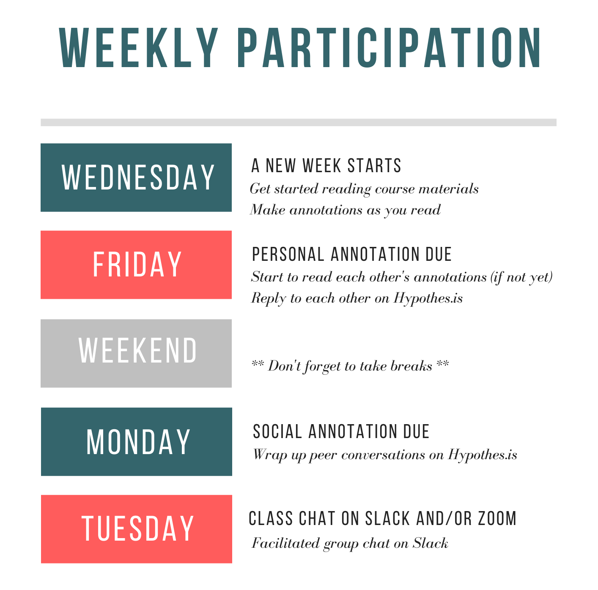

# Theory and Learning Analytics

[Learning analytics are about learning](https://link.springer.com/article/10.1007%2Fs11528-014-0822-x), so *theories of learning* should not be ditched despite the data deluge that has been fueling the growth of learning analytics. 

Since the dawn of the field, there have been voices arguing for the importance of learning theory in the design, development, and implementation of learning analytics. In 2015, [a special section](https://learning-analytics.info/journals/index.php/JLA/issue/view/358) was published by the *Journal of Learning Analytics* on the relation between learning theory and learning analytics. In the guest editorial, Wise and Shaffer (2015, p. 5) write:

> It is an exhilarating and important time for conducting research on learning, with unprecedented quantities of data available. There is danger, however, in thinking that with enough data, the numbers speak for themselves. In fact, with larger amounts of data, theory plays an ever-more critical role in analysis.

<!--  -->

The notion that theory matters even more in "big data" research in education goes against what was proposed in a controversial *Wired* article titled "[The end of theory: The data deluge makes the scientific method obsolete](https://www.wired.com/2008/06/pb-theory/)" (Anderson, 2008).  Now there is little disagreement that learning theory is essential for learning analytics.

## Learning Analytics and Learning Theory

Briefly speaking, there are essentially two ways theory is important for the field of learning analytics.

**1. Theory Use in Learning Analytics**

As a field of research and practice, learning analytics work naturally draws from all sorts of theories. As summarized by Wise and Shaffer (2015, p. 9):

- Theory gives a researcher guidance about which variables to include in a model
- Theory gives a researcher guidance about what potential confounds, subgroups, or covariates in  the data to account for
- Theory gives a researcher guidance as to which results to attend to
- Theory gives a researcher a framework for interpreting results
- Theory gives a researcher guidance about how to make results actionable
- Theory helps a researcher generalize results to other contexts and populations

For example, *self-regulated learning* (SRL) is widely used in learning analytics and MOOC research. SRL as a learning theory has informed data collection, data transformation, data mining, and result interpretation.

<!--  -->

**2. Theory Building in Learning Analytics**

Even more exciting to me is the possibility of building new theories of learning and teaching, based on fine-grained data analysis enabled by advanced computational methods. Learning analytics and educational data mining research could give rise to new theories. For example, whether keystroke analysis can shed light on our understanding of writing processes? Whether temporal analysis can uncover "productive" patterns of collaborative discourse?

Equally valuable are theories of learning analytics usage in emerging socio-technical contexts. For example, as new learning analytics tools are put in the hands of instructors to aid their pedagogical decisions, domain theories of analytics use can be created (e.g., van Leeuwen, 2015).

After exploring cases and proposing possible project ideas last week, it is a great time for us to think about learning theory relevant to our project ideas!

## Week 5 Learning Activities

### Read, annotate, and discuss

This week's readings speak in particular to *theory use* in learning analytics.  **Reading #2** provides a concrete example of using a well-established learning theory (self-regulated learning in this case) in a research study. **Reading #3** (optional) is the controversial Wired article mentioned above. 

1. **Skim**: @wise2015why - [download link](https://files.eric.ed.gov/fulltext/EJ1127063.pdf). This reading is a guest editorial about learning analytics and learning theory. Please skim through it and no need to annotate closely.
2. **Read & Annotate**: @winne2017learning - [download link](https://solaresearch.org/wp-content/uploads/2017/05/chapter21.pdf). This reading discusses a very established learning theory -- Self-Regulated Learning (SRL) -- that is widely adopted in learning analytics. Please read and take time to "notice" how the author discusses SRL and connects SRL constructs with data. 
2. **Skim**: @kizilcec2017selfregulated - [download link](https://www-sciencedirect-com.ezp3.lib.umn.edu/science/article/pii/S0360131516301798) (*Note: This file is accessible via the UMN Libraries.*) The third reading is a study that examines SRL in MOOCs. Please skim through it to see how the authors used SRL theory to grapple with the learning phenomenon.
<!-- 2. @chen2018critical Chen, B., Knight, S., & Wise, A. F. (2018). [Critical Issues in Designing and Implementing Temporal Analytics](https://files.eric.ed.gov/fulltext/EJ1176035.pdf). Journal of Learning Analytics, 5(1), 1–9. (**Note: Only Sections 3-4 (pp. 3-7) are required.**) -->

As always, please annotate and interact as you like. Please use tags intentionally in your annotations to help you retrieve ideas potentially useful for our course projects.

As a reminder, please strive to stick to the weekly participation schedule:

### Meet Learning Analytics Experts

<!-- **[Dr. Alyssa Wise](https://steinhardt.nyu.edu/faculty/Alyssa_Wise)** is Associate Professor of Learning Sciences and Educational Technology and the Director of the [Learning Analytics Research Network](https://steinhardt.nyu.edu/learn/) at NYU. She is an Editor in Chief of the *Journal of Learning Analytics* and an Associate Editor of the *Journal of the Learning Sciences*. According to her bio, "Dr. Wise's research is situated at the intersection of the learning sciences and educational data science, focusing on the design of learning analytics systems that are theoretically grounded, computationally robust, and pedagogically useful for informing teaching and learning." Among many wise things shared by Dr. Wise, below is a recent video clip of her talking about what we need to be successful in the field of learning analytics. She is also scheduled to deliver **a webinar on Oct 16 2019** about [*Designing Learning Analytics for Humans with Humans*](https://www.eventbrite.com.au/e/designing-learning-analytics-for-humans-with-humans-prof-alyssa-wise-registration-73251177243).  -->

<!-- <iframe width="560" height="315" src="https://www.youtube-nocookie.com/embed/NZeRxSC0ABs?rel=0" frameborder="0" allow="autoplay; encrypted-media" allowfullscreen></iframe> -->

**[Dr. David Williamson Shaffer](https://edpsych.education.wisc.edu/staff/williamson-shaffer-david/)** is the Vilas Distinguished Professor of Learning Sciences at the University of Wisconsin-Madison. He is known for his work on game-based learning and [Epistemic Network Analysis](http://www.epistemicanalytics.org/). Below is a keynote speech he delivered at the 2018 Learning Analytics and Knowledge conference in Sydney, where he summarized his idea of "quantitative ethonography" and ways to tackle theory scarcity in the age of "big data."

<iframe width="560" height="315" src="https://www.youtube-nocookie.com/embed/LjcfGSdIBAk?rel=0" frameborder="0" allow="autoplay; encrypted-media" allowfullscreen></iframe>

### Special Interest Group (SIG) Signup

I will distribute a SIG signup form on Slack. Please fill the form with your preferred topics. 

As a reminder:

> "With support from the instructor, each SIG is expected to take a lead on designing learning activities, presenting key ideas, and facilitating discussion. Each SIG will meet with the instructor one week in advance to finalize their course plan." (From course syllabus)

Feel free to ask questions on Slack if you're unsure about any SIG topics.

<!-- **Please continue to explore and articulate your Working Group project ideas on Knowledge Forum.** Please consider *problems/goals*, *stakeholders*, *data sources*, *analysis*, and *action* of your group project. Feel free to team up! -->

### Continue to advance your project idea

Please continue to articulate or advance your project idea. Use this week's readings and discussions to help you more clearly conceptualize the learning phenomenon you're interested in. Do some literature search to find out theories relevant to your project. Share in the `#projects` channel things you find!

Have a great week!

